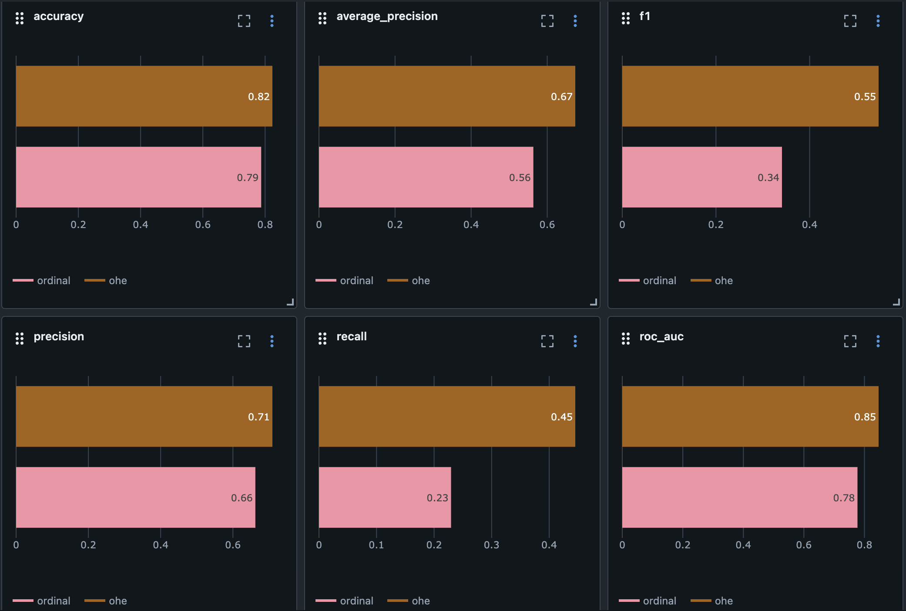
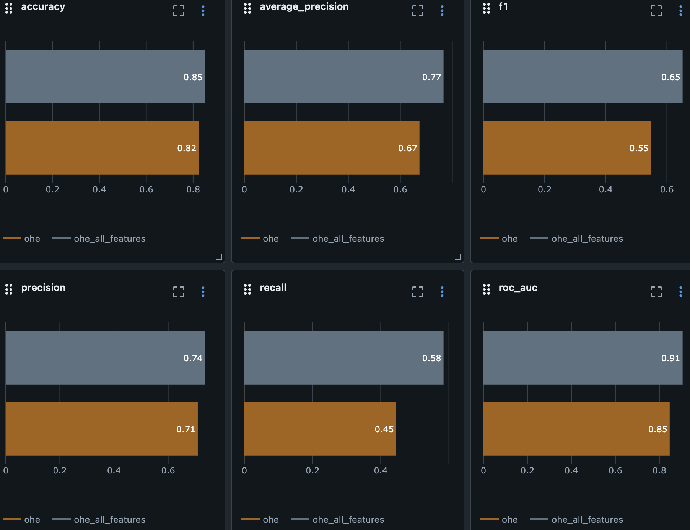

# mlflow_example
Пример использования mlflow для трекинга экспериментов

Запуск пайплайна &mdash; `python3 runner.py`

# Эээксперименты:

1)Поймем какой экодинг лучше и какие фичи донабрать
2)Потом выберем самую норма работающую модель с +- базовыми параметрами
3)Донастроим параметры модельки

Смотреть 10 метрик смысла особо нету. Поэтому ориентироваться будем на ROC-AUC. Дизбаланс классов не сильный - 3 к 1, она норм будет работать.
фиксируем train_size: 10000

## фичи

Сначала пробуем OneHotEncoder против того что был изначально в шаблоне OrdinalEncoding
Гипотеза - ohe круче
Параметр - тип кодирования категориальных фичей

ordinal rocauc - 0.777
ohe rocauc - 0.846

(я хз работает ли такая вставка картинки, чатгпт сказал так делать. Если нет, то оно в папке images)

Оставляем OHE

Теперь пробуем добавить все фичи что есть

Гипотеза - все фичи круче
Параметр - все фичи/те что были в шаблоне

ohe rocauc - 0.846
ohe_all_features rocauc - 0.906

Обьектов у нас в избытке, поэтому причин выкидывать фичи наверное нет. Не будем проводить такие экспы.

## выбор модели

Пробуем разные модели, логрег уже попробовали. Имели rocauc - 0.906

Гипотеза - Что то будет работать лучше логистической регрессии
Параметр - тип модели

ohe_all_features_random_forest rocauc - 0.897
ohe_all_features_gradient_boosting - 0.9143

[Описание картинки](./images/models.png)

Оставляем градиентный бустинг

## настройка параметров модели

Пробуем экспоненциальный лосс:

Гипотеза - exponential loss круче
Параметр - вид лосса

ohe_all_features_gradient_boosting - 0.9143
ohe_all_features_gradient_boosting_exp_loss rocauc - 0.9128

[Описание картинки](./images/log_loss_exp.png)

не берем

Пробуем разное число деревьев

Гипотеза - число деревьев не оптимальное круче
Параметр - число деревьев

ohe_all_features_gradient_boosting_n_estim_90 rocauc - 0.9118
ohe_all_features_gradient_boosting_n_estim_70 rocauc - 0.9097
ohe_all_features_gradient_boosting_n_estim_110 rocauc - 0.9158
ohe_all_features_gradient_boosting_n_estim_130 rocauc - 0.9161

хмм, видно небольшой рост качества с ростом числа деревьев, попробуем еще несколько значений - мб найдем оптимум после которого пойдет переобучение и падение качества на тесте.

ohe_all_features_gradient_boosting_n_estim_160 - 0.9187
ohe_all_features_gradient_boosting_n_estim_200 - 0.9204
ohe_all_features_gradient_boosting_n_estim_300 - 0.9205
ohe_all_features_gradient_boosting_n_estim_400 - 0.9215
ohe_all_features_gradient_boosting_n_estim_400 - 0.9224

Ну видимо не найдем, уже долговато обучение ждать. Ну и ладно.

[Сверху - самые последние в отчете запуски с разным n_estimates, снизу самые первые](./images/n_estim.png)

Итого лучший запуск:
http://158.160.2.37:5000/#/experiments/17/runs/f77463450b9e4f75ae87f7bbb1d17825

Теперь сделаем три запуска для доп задания - с сохранением датасета:
http://158.160.2.37:5000/#/experiments/17/runs/0b401aa0c91345a9871ec1e1bfe42432
http://158.160.2.37:5000/#/experiments/17/runs/bfa4cabc4c7d44feba854128184b1b1c
http://158.160.2.37:5000/#/experiments/17/runs/026e7ff79f64451bbf5cfbe2be3194a3

